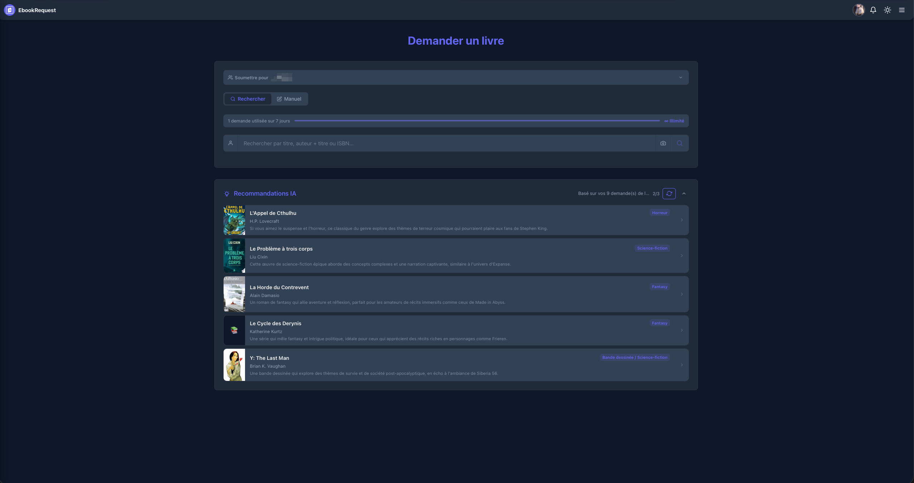
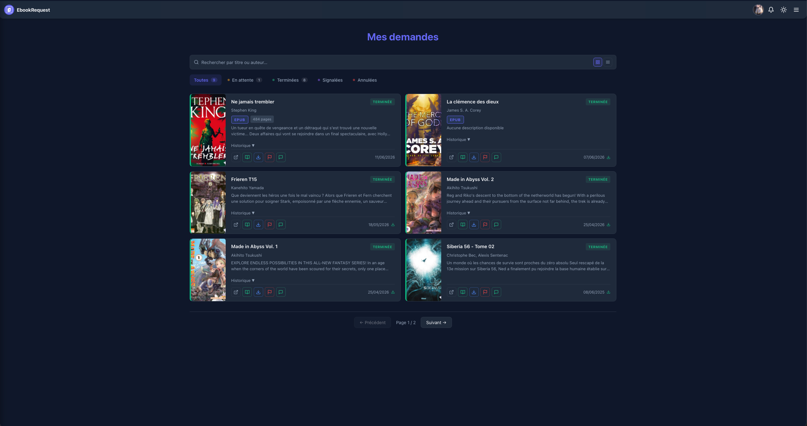
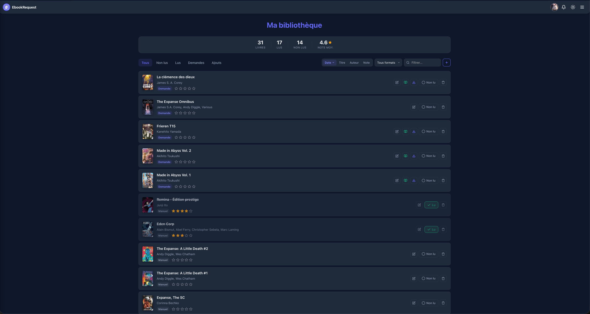
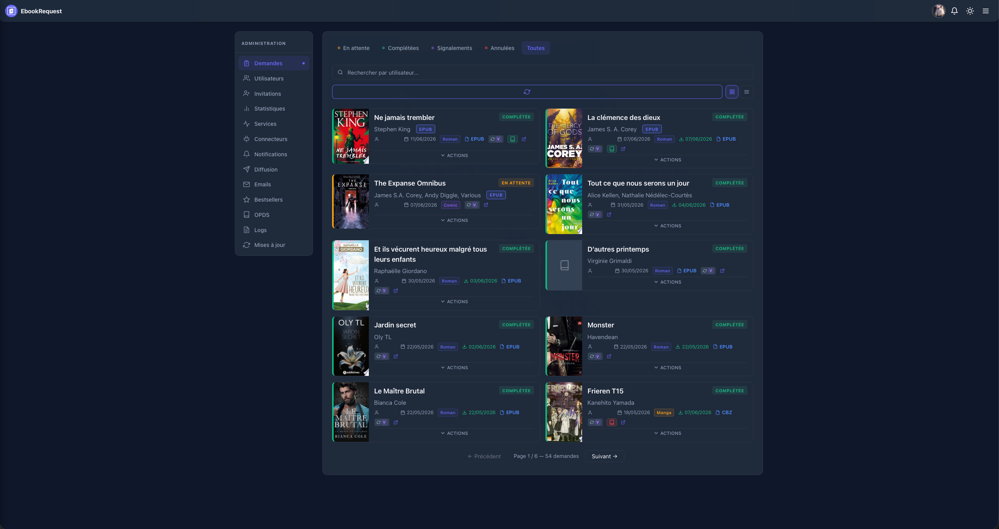
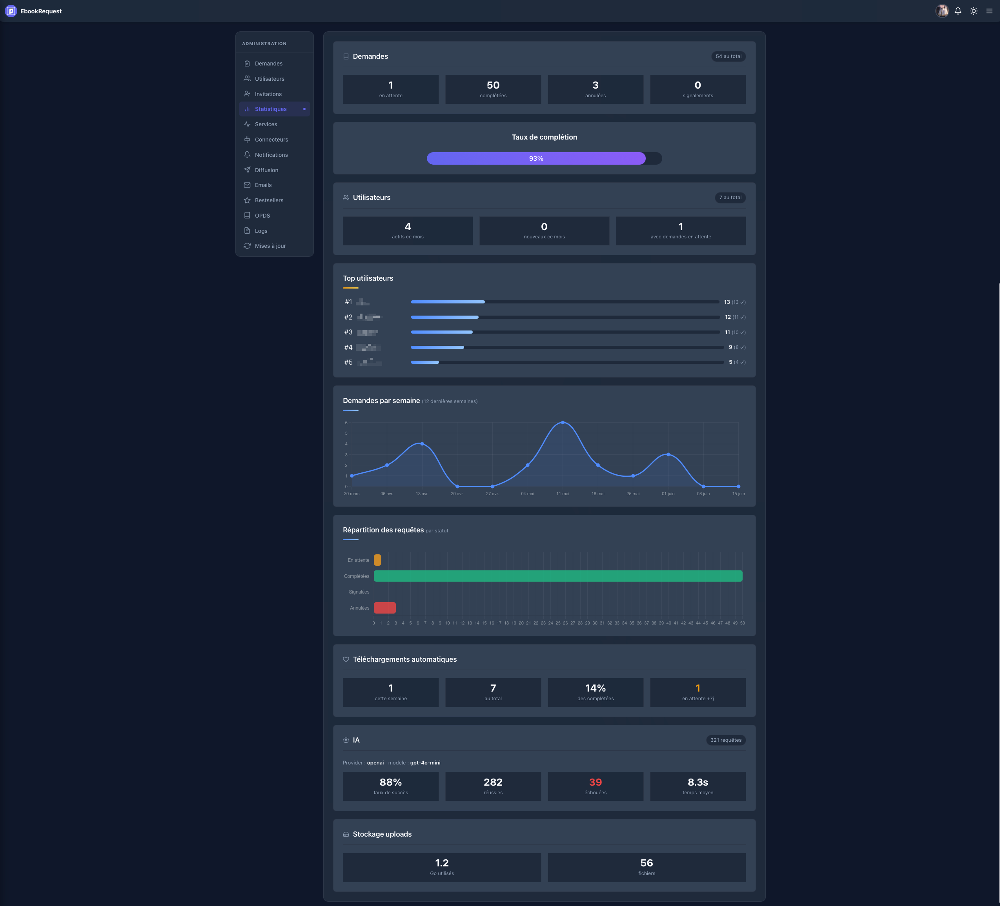

# EbookRequest

<div align="center">
  
</div>

<div align="center">

[](https://hub.docker.com/r/zlimteck/ebookrequest)
[](https://hub.docker.com/r/zlimteck/ebookrequest-mcp)
[](https://github.com/zlimteck/ebookrequest_app/actions)
[](https://opensource.org/licenses/MIT)
[](https://github.com/zlimteck/ebookrequest_app/stargazers)

</div>

Gérez les demandes de livres numériques de vos proches, de la soumission jusqu'au téléchargement automatique — self-hosted, en français.

> 🇫🇷 Projet développé par et pour la communauté francophone. Interface, documentation et support entièrement en français.
>
> Si le projet vous est utile, une ⭐ sur GitHub fait toujours plaisir et aide à le faire connaître !

## Aperçu

<div align="center">
  
  
  
  
</div>

<div align="center">
  
</div>

## Table des matières

- [Stack](#stack)
- [Fonctionnalités](#fonctionnalités)
- [API](#api)
- [Déploiement Docker](#déploiement-docker)
  - [Prérequis](#prérequis)
  - [Image Docker](#image-docker)
  - [docker-compose.yml](#docker-composeyml)
  - [Variables d'environnement](#variables-denvironnement)
  - [Lancer l'application](#lancer-lapplication)
  - [Reverse proxy (HTTPS)](#reverse-proxy-https)
  - [Créer le compte administrateur](#créer-le-compte-administrateur)
  - [Mise à jour](#mise-à-jour)
  - [Accès OPDS](#accès-opds)
- [Structure du projet](#structure-du-projet)
- [Remerciements](#remerciements)

## Stack

- **Frontend** — React, React Router, Chart.js, Axios
- **Backend** — Node.js, Express, MongoDB (Mongoose), JWT
- **Notifications** — Email (SMTP), Push (VAPID), Apprise
- **IA** — OpenAI / Ollama / Claude (Anthropic) (recommandations, descriptions)
- **Connecteurs** — Valentine (téléchargement auto), Anna's Archive (recherche + téléchargement via FlareSolverr), Calibre-Web (envoi + sync étagère Kobo)
- **Visionneuse** — PDF (navigateur natif), EPUB (epub.js via react-reader), CBZ/CBR (JSZip)
- **Conversion** — Calibre (`ebook-convert`) intégré dans l'image Docker — EPUB ↔ MOBI, AZW3, FB2 ; CBZ → PDF (JSZip + pdfkit, sans dépendance externe)
- **Déploiement** — Docker, GitHub Actions, Docker Hub

## Fonctionnalités

**Demandes**
- Soumission et suivi de demandes de livres
- Recherche via Google Books API avec auto-complétion des métadonnées :
  - **Par titre ou ISBN** — recherche directe ou par code ISBN-10/13
  - **Par auteur** — résultats filtrés en français, triés du plus récent au plus ancien
  - **Auteur + Titre combinés** — saisir `Prénom Nom Titre du livre` sans séparateur (ex : `Virginie Grimaldi D'autres printemps`)
  - **Scan de code-barres** — scanner l'ISBN directement depuis la caméra de l'appareil
- Vérification de disponibilité à la soumission (flux PreDB)
- Quota de demandes configurable par utilisateur (nombre + fenêtre glissante en jours)
- Soumission admin au nom d'un autre utilisateur

**Téléchargement**
- Téléchargement automatique via Valentine, avec fallback Anna's Archive
- Recherche manuelle sur les connecteurs depuis le panel admin
- Envoi automatique du fichier vers Calibre-Web à la complétion d'une demande
- Synchronisation automatique de l'étagère Kobo dans Calibre-Web (le livre apparaît directement sur la liseuse)

**Utilisateurs & accès**
- Inscription par invitation email ou code d'invitation (usage limité, expiration configurable)
- Authentification deux facteurs (2FA — TOTP) avec codes de récupération
- Réinitialisation de mot de passe par email
- Gestion des utilisateurs (rôles, quotas, activation/désactivation)
- Catalogue OPDS pour accès depuis les liseuses (Calibre, KOReader…)

**Notifications**
- Notifications email et push (VAPID) par événement
- Notifications multi-services via Apprise (Pushover, Discord, Telegram, Slack, Gotify, Ntfy…)
  - Côté admin : notifications globales configurables par événement (nouvelle demande, complétion, annulation, commentaire, signalement, nouvel utilisateur)
  - Côté utilisateur : chaque utilisateur peut configurer ses propres URLs Apprise dans ses paramètres pour recevoir ses notifications personnelles (livre disponible, annulation, commentaire admin)
- Diffusion admin (email HTML + push vers tous les utilisateurs)

**Bibliothèque & lecture**
- Bibliothèque personnelle avec statut de lecture, notation par étoiles et notes libres
- Tri par date, titre, auteur ou note — filtre par source (demandes / ajouts manuels)
- Visionneuse in-browser sans installation :
  - **PDF** — viewer natif du navigateur
  - **EPUB** — lecteur paginé avec réglage de la taille de police, mode nuit, barre de progression, swipe mobile et sauvegarde automatique de la position de lecture
  - **CBZ / CBR** — galerie image avec navigation clavier et swipe, position mémorisée
- Bouton « Lire » disponible dans la bibliothèque, les demandes utilisateur et le panel admin
- **Conversion de format au téléchargement** — modal dédié avec conversion à la volée :
  - Ebooks (EPUB, MOBI, AZW3, FB2) : conversion via Calibre (`ebook-convert`), inclus dans l'image Docker — aucune configuration requise
  - Comics/BD (CBZ) : conversion en PDF via JSZip + pdfkit, sans dépendance externe
  - Affichage du poids du fichier original et du fichier converti
  - Les fichiers convertis sont automatiquement supprimés après 24h

**Découverte & IA**
- Page Découverte (tendances, bestsellers, recommandations IA)

**Administration**
- Panel admin avec statistiques et logs
- Visionneuse de logs système en temps réel

**Intégration (MCP)**
- Serveur MCP pour gérer ses demandes directement depuis un assistant IA
- Outils utilisateur : rechercher un livre, créer une demande (couverture auto via Google Books), consulter ses demandes, vérifier la disponibilité, annuler une demande, consulter stats et bibliothèque
- Outils admin : demandes en attente, statistiques globales, changer le statut d'une demande, lister les utilisateurs
- Compatible avec tous les clients MCP : [ChatMCP](https://apps.apple.com/fr/app/chatmcp/id6745196560) (iOS/iPadOS), Claude Desktop (Mac/Windows), Claude Web
- Deux modes de déploiement : **HTTP** (hébergé sur VPS, accessible depuis n'importe où) ou **stdio** (local, pour Claude Desktop)
- Voir [`mcp/README.md`](mcp/README.md) pour la configuration

## API

La référence complète des endpoints REST avec exemples `curl` est disponible dans [`API.md`](API.md).

## Déploiement Docker

### Prérequis

- Docker et Docker Compose
- Une instance MongoDB — [MongoDB Atlas](https://www.mongodb.com/atlas) (cloud, gratuit en tier M0) ou une instance locale

### Image Docker

L'image est disponible publiquement sur Docker Hub :

```
zlimteck/ebookrequest:latest
```

👉 [hub.docker.com/r/zlimteck/ebookrequest](https://hub.docker.com/r/zlimteck/ebookrequest)

### docker-compose.yml

Un `docker-compose.yml` est fourni à la racine du projet. Il inclut le conteneur principal **ebookrequest** ainsi que **FlareSolverr** (nécessaire pour Anna's Archive) :

```yaml
services:
  ebookrequest:
    image: zlimteck/ebookrequest:latest
    container_name: ebookrequest
    restart: always
    ports:
      - "${PORT:-5001}:5001"
    volumes:
      - ${UPLOADS_PATH}:/app/uploads
    environment:
      - NODE_ENV=production
      - MONGODB_URI=${MONGODB_URI}
      - JWT_SECRET=${JWT_SECRET}
      - FRONTEND_URL=${FRONTEND_URL}
      # ... (voir .env.example pour la liste complète)
    extra_hosts:
      - "host.docker.internal:host-gateway"

  flaresolverr:
    image: ghcr.io/flaresolverr/flaresolverr:latest
    container_name: flaresolverr
    restart: unless-stopped
    ports:
      - "8191:8191"
```

> Les variables d'environnement sont lues depuis le fichier `.env` placé au même niveau que `docker-compose.yml`.

> **FlareSolverr** est inclus dans le `docker-compose.yml` et démarré automatiquement. Il est nécessaire pour contourner la protection Cloudflare d'Anna's Archive lors des téléchargements automatiques. Sans lui, le connecteur Anna's Archive ne fonctionnera pas. L'URL est préconfigurée à `http://flaresolverr:8191` — aucune configuration supplémentaire n'est requise si tu utilises le `docker-compose.yml` fourni.

### Variables d'environnement

Copie `.env.example` en `.env` et remplis les valeurs :

```bash
cp .env.example .env
```

#### Général

| Variable | Description |
|---|---|
| `NODE_ENV` | `production` ou `development` |
| `PORT` | Port du backend (défaut : `5001`) |
| `MONGODB_URI` | URI de connexion MongoDB (Atlas ou local) |
| `JWT_SECRET` | Clé secrète pour signer les tokens JWT — choisir une valeur longue et aléatoire |
| `UPLOADS_PATH` | Chemin absolu du dossier de stockage des fichiers uploadés |

#### URLs

| Variable | Description |
|---|---|
| `FRONTEND_URL` | URL publique de l'application (ex : `https://ebook.tondomaine.fr`). Utilisée pour les liens dans les emails (vérification, reset mot de passe, invitations) et la configuration CORS en production. **Obligatoire en production.** |
| `REACT_APP_API_URL` | URL du backend utilisée par le frontend au moment du build (ex : `https://ebook.tondomaine.fr`). Nécessaire uniquement si le frontend et le backend sont sur des origines différentes. En monorepo (frontend servi par le backend), laisser vide — les requêtes sont alors relatives (`/api/...`). |

#### Email

| Variable | Description |
|---|---|
| `EMAIL_PROVIDER` | `smtp` (défaut) ou `resend` |
| `SMTP_HOST` | Adresse du serveur SMTP (ex : `smtp.gmail.com`) |
| `SMTP_PORT` | Port SMTP — `587` pour STARTTLS, `465` pour SSL/TLS |
| `SMTP_SECURE` | `false` avec le port `587` (STARTTLS), `true` avec le port `465` (SSL) — **ne pas mélanger** |
| `SMTP_USER` | Identifiant de connexion SMTP |
| `SMTP_PASSWORD` | Mot de passe SMTP |
| `EMAIL_FROM_ADDRESS` | Adresse expéditrice des emails |
| `EMAIL_FROM_NAME` | Nom affiché dans les emails (ex : `EbookRequest`) |
| `RESEND_API_KEY` | Clé API Resend (si `EMAIL_PROVIDER=resend`) |
| `RESEND_WEBHOOK_SECRET` | Secret de signature webhook Resend (optionnel, recommandé) |

#### Push notifications

| Variable | Description |
|---|---|
| `VAPID_PUBLIC_KEY` | Clé publique VAPID |
| `VAPID_PRIVATE_KEY` | Clé privée VAPID |

Générer les clés VAPID :
```bash
npx web-push generate-vapid-keys
```

#### Intelligence artificielle

| Variable | Description |
|---|---|
| `AI_PROVIDER` | `openai`, `ollama` ou `claude` |
| `OPENAI_API_KEY` | Clé API OpenAI (si `AI_PROVIDER=openai`) |
| `OPENAI_MODEL` | Modèle OpenAI à utiliser (ex : `gpt-4o-mini`) |
| `OLLAMA_URL` | URL du serveur Ollama (si `AI_PROVIDER=ollama`, ex : `http://172.17.0.x:11434`) |
| `OLLAMA_MODEL` | Nom du modèle Ollama |
| `OLLAMA_TIMEOUT` | Timeout en ms pour les requêtes Ollama (défaut : `60000`) |
| `ANTHROPIC_API_KEY` | Clé API Anthropic (si `AI_PROVIDER=claude`) — [console.anthropic.com](https://console.anthropic.com) |
| `CLAUDE_MODEL` | Modèle Claude à utiliser (ex : `claude-opus-4-5`, `claude-sonnet-4-5`) |

#### Connecteurs & services externes

| Variable | Description |
|---|---|
| `GOOGLE_BOOKS_API_KEY` | Clé API Google Books (recherche et métadonnées) |
| `APPRISE_URL` | URL du service Apprise pour les notifications. Par défaut `http://apprise:8000` (conteneur inclus dans le `docker-compose.yml`). Supprimer le service `apprise` du compose si vous hébergez déjà Apprise ailleurs, et renseigner son URL ici. Ne pas ajouter `/notify` — le chemin est ajouté automatiquement. Voir [github.com/caronc/apprise-api](https://github.com/caronc/apprise-api). |
| `APPRISE_CONFIG_PATH` | Chemin local vers le dossier de configuration Apprise (défaut : `./apprise-config`). Nécessaire si `APPRISE_STATEFUL_MODE=simple` est activé sur le conteneur Apprise. |
| `TZ` | Fuseau horaire des conteneurs (ex : `Europe/Paris`). Utile pour que les logs s'affichent à la bonne heure. |
| `FLARESOLVERR_URL` | URL du service FlareSolverr pour contourner les protections Cloudflare (défaut : `http://flaresolverr:8191`) |
| `RSS_FEED_URL` | URL du flux RSS (PreDB) utilisé pour vérifier si un livre est récemment sorti et estimer sa disponibilité au moment de la demande (défaut : `https://predb.me/?cats=books-ebooks&rss=1`) |
| `MCP_PORT` | Port du serveur MCP (défaut : `3035`) |
| `MCP_URL` | URL publique du serveur MCP (ex : `https://mcp.ndd.fr`). Affichée aux utilisateurs dans les paramètres. Optionnel — si absent, la section MCP est masquée. |
| `MCP_INTERNAL_URL` | URL interne du serveur MCP pour le health check depuis le backend (défaut : `http://ebookrequest-mcp:3035`). Utile quand le backend et le MCP sont sur le même réseau Docker — évite de passer par l'URL publique. |

Le service `apprise` inclus dans le `docker-compose.yml` utilise une configuration de base. Voici les variables d'environnement utiles à ajouter directement sur le service `apprise` selon vos besoins :

| Variable | Description |
|---|---|
| `APPRISE_STATEFUL_MODE=simple` | Active la persistance des configurations Apprise dans un fichier. Sans ça, les URLs configurées sont perdues au redémarrage du conteneur. Recommandé si vous utilisez le panel de configuration d'Apprise. |
| `APPRISE_ADMIN=y` | Active l'interface d'administration web d'Apprise (accessible sur le port exposé). Permet de gérer les configurations via une UI. |
| `APPRISE_WORKER_COUNT=1` | Nombre de workers pour le traitement des notifications. La valeur par défaut peut consommer plus de ressources inutilement sur un petit serveur. |

Exemple de configuration avancée du service `apprise` :

```yaml
apprise:
  image: caronc/apprise:latest
  container_name: apprise
  environment:
    - APPRISE_STATEFUL_MODE=simple
    - APPRISE_WORKER_COUNT=1
    - APPRISE_ADMIN=y
    - TZ=Europe/Paris
  volumes:
    - /chemin/vers/apprise/config:/config
  ports:
    - "8000:8000"
  restart: unless-stopped
```

### Lancer l'application

```bash
docker-compose up -d
```

L'application est accessible sur le port défini dans `PORT` (défaut : `5001`).

### Reverse proxy (HTTPS)

L'application écoute sur le port `5001` en HTTP. Pour l'exposer sur un domaine en HTTPS, place un reverse proxy devant (Nginx Proxy Manager, Traefik, Caddy…) qui redirige le trafic HTTPS vers `localhost:5001`.

Pense à renseigner `FRONTEND_URL` avec ton URL publique pour que les liens dans les emails fonctionnent correctement.

### Créer le compte administrateur

Au premier lancement, ouvre l'application dans ton navigateur — tu seras redirigé automatiquement vers la page `/setup` pour créer le compte administrateur.

### Mise à jour

Pour mettre à jour vers la dernière version :

```bash
docker-compose pull
docker-compose up -d
```

### Accès OPDS

Le catalogue OPDS est accessible à l'adresse suivante (pour connecter une liseuse, Calibre, KOReader…) :

```
http(s)://ton-domaine/opds
```

Le token d'accès personnel est disponible dans les paramètres du compte utilisateur.

## Structure du projet

```
ebookrequest/
├── src/                        # Backend Express
│   ├── controllers/
│   ├── middleware/
│   ├── models/
│   ├── routes/
│   ├── scripts/                # initAdmin, migrations
│   ├── services/               # email, push, IA, trending...
│   └── index.js
├── frontend/                   # React app
│   ├── public/
│   └── src/
│       ├── components/
│       ├── context/
│       ├── hooks/
│       ├── pages/
│       ├── services/
│       ├── styles/
│       └── utils/
├── mcp/                            # Serveur MCP (Claude Desktop / iOS / Web)
│   ├── src/index.js
│   ├── Dockerfile
│   └── README.md
├── .env.example
├── docker-compose.yml
└── Dockerfile
```

---

## Remerciements

Un grand merci à [@Gusdezup](https://github.com/Gusdezup) pour ses idées et suggestions qui ont contribué à enrichir le projet, notamment la synchronisation Calibre, l'étagère Calibre et la synchronisation Kobo.